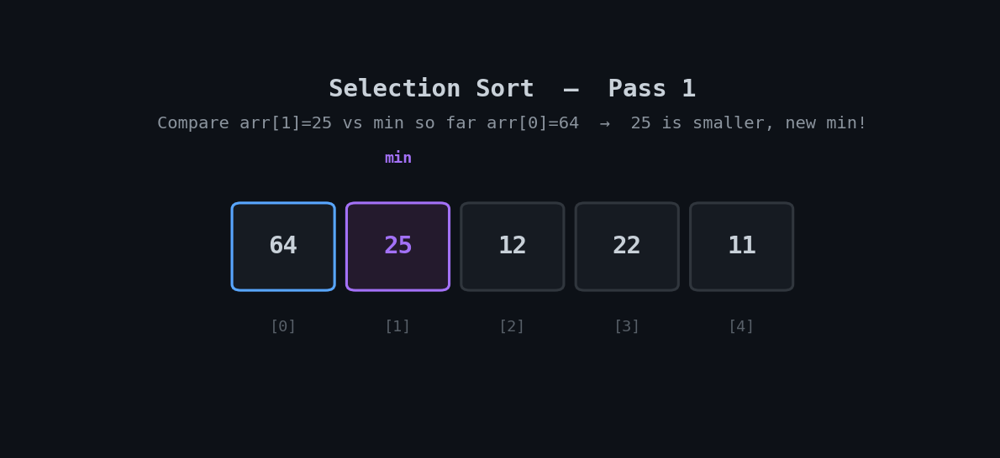

<h1 align="center">🎖️ Selection Sort</h1>

<p align="center">
  <i>An animated, beginner-friendly walkthrough of the Selection Sort algorithm with a clean Python implementation.</i>
</p>

<p align="center">
  
  
  
</p>

---

## 📽️ Visual Walkthrough

Selection Sort repeatedly finds the **smallest remaining value** in the unsorted portion of the array and swaps it into its correct position — one final position locked per pass.

<p align="center">
  
</p>

> 🔵 Blue = current slot being filled · 🟣 Purple = smallest value found so far · 🟡 Amber = element being compared · 🟠 Orange = swap happening · 🟢 Green = locked in final sorted position

---

## ⚙️ How It Works

1. For each position `i` from left to right, assume it holds the minimum.
2. Scan the rest of the array (`i+1` to the end) to find the actual smallest value.
3. Swap that smallest value into position `i`.
4. Move to the next position and repeat — the sorted portion grows by one each pass.

---

## ⏱️ Complexity

| Case | Time | Space |
|---|---|---|
| Best | `O(n²)` | `O(1)` |
| Average | `O(n²)` | `O(1)` |
| Worst | `O(n²)` | `O(1)` |

Unlike Bubble Sort, Selection Sort has **no early-exit** optimization — it always scans the full remaining array every pass, so its best case is still `O(n²)`. Its advantage is a low number of swaps: at most `n - 1` swaps total, which matters when swapping is expensive.

---

## 🐍 Implementation

```python
def selection_sort(arr):
    n = len(arr)
    for i in range(n - 1):
        # Assume the current position holds the minimum
        min_index = i

        # Find the minimum element in the unsorted portion
        for j in range(i + 1, n):
            if arr[j] < arr[min_index]:
                min_index = j

        # Swap the found minimum with the first unsorted element
        arr[i], arr[min_index] = arr[min_index], arr[i]

    return arr


# Example usage
numbers = [64, 25, 12, 22, 11]
print("Original array:", numbers)
sorted_numbers = selection_sort(numbers)
print("Sorted array:", sorted_numbers)
```

> 💡 Full file: [`selection_sort.py`](./selection_sort.py)

---

## ▶️ Run It

```bash
git clone https://github.com/zain-cs/7-Selection-Sort.git
cd 7-Selection-Sort
python selection_sort.py
```

---

## 🔁 Bubble Sort vs. Selection Sort

| | Bubble Sort | Selection Sort |
|---|---|---|
| Time complexity | `O(n²)`, `O(n)` best case | `O(n²)` always |
| Number of swaps | Can be many | At most `n - 1` |
| Early exit if sorted | ✅ Yes | ❌ No |
| Stable? | ✅ Yes | ❌ No (can reorder equal elements) |

Selection Sort is preferable when **write/swap operations are costly** (e.g. flash memory), since it minimizes swaps even though it doesn't minimize comparisons.

---

## 🗺️ Part of a DSA Series

📌 [Linear Search](https://github.com/zain-cs/1-Linear-Search) → [Binary Search](https://github.com/zain-cs/2-Binary-Search) → [Ternary Search](https://github.com/zain-cs/3-Ternary-Search) → [Jump Search](https://github.com/zain-cs/4-Jump-Search) → [Exponential Search](https://github.com/zain-cs/5-Exponential-Search) → [Bubble Sort](https://github.com/zain-cs/6-Bubble-Sort) → **Selection Sort** → more to come as I work through DSA.

---

<p align="center">
  Made with 🐍 by <a href="https://github.com/zain-cs">Muhammad Zain Ul Abidin</a>
</p>
